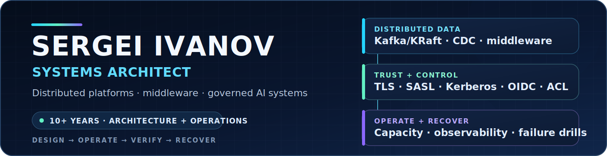

  

  <a href="https://kavioavio.ru">Website</a> ·
  <a href="https://www.linkedin.com/in/sergei-ivanov-73856b3a7">LinkedIn</a>

I design and operate systems where reliability, security, and operator clarity matter more than demo polish. My background spans more than ten years in systems integration, middleware, production operations, and architecture.

## What I work on

| Area | Focus |
|---|---|
| Distributed platforms | Kafka in KRaft mode, availability, capacity, secure client access, CDC, and operational standards |
| Governed AI systems | Multi-agent orchestration, tenant isolation, policy-controlled execution, verifiable receipts, and human review |
| Platform engineering | Go and Python services, PostgreSQL, Linux, containers, CI/CD, observability, and recovery paths |
| Middleware security | TLS/mTLS, SASL, Kerberos, OAuth/OIDC, ACL/RBAC, secrets boundaries, and fail-closed automation |

## Core stack

`Apache Kafka` · `KRaft` · `Go` · `Python` · `Linux` · `PostgreSQL` · `Docker` · `Kubernetes` · `Ansible` · `Prometheus` · `Grafana`

## Engineering principles

- Make failure modes explicit and recoverable.
- Keep privileged execution behind narrow, auditable boundaries.
- Prefer evidence from real runtime paths over local-only success.
- Treat deployment, observability, backup, and rollback as part of the product.
- Keep private infrastructure and product IP private by default.

## Current direction

I am building private product and platform systems around governed AI execution, multi-tenant runtimes, operator tooling, and verifiable automation. Public extracts are published only after security and IP review.

## Contact

For systems architecture, middleware, platform engineering, or technical advisory work:
[LinkedIn](https://www.linkedin.com/in/sergei-ivanov-73856b3a7) · [kavioavio.ru](https://kavioavio.ru)

<!-- github-profile-readme -->
