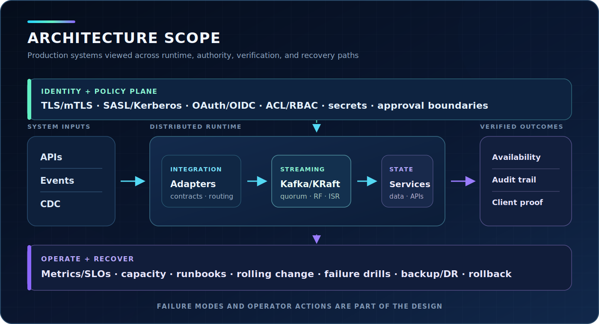

  

  <a href="https://kavioavio.ru">Website</a> ·
  <a href="https://www.linkedin.com/in/sergei-ivanov-73856b3a7">LinkedIn</a>

I am a systems architect with 10+ years in systems integration, middleware, distributed platforms, and production operations. I work across the full operating path: topology, identity, deployment, observability, failure handling, and recovery.

## Architecture scope

  

I treat failure modes, operator actions, and client-visible verification as architecture inputs rather than post-deployment tasks.

## Focus

| Area | Work |
|---|---|
| Distributed streaming | Kafka/KRaft topology, quorum design, replication, `min.insync.replicas`, capacity, upgrades, and failure boundaries |
| Integration and middleware | Event-driven integration, CDC, connectors, APIs, message contracts, IBM MQ, and IBM Integration Bus |
| Identity and policy | TLS/mTLS, SASL, Kerberos, OAuth/OIDC, ACL/RBAC, secret boundaries, and fail-closed automation |
| Production operations | Observability, capacity planning, runbooks, rolling changes, backup/DR decisions, restore tests, and incident recovery |

## Core technologies

`Apache Kafka` · `KRaft` · `IBM MQ` · `IBM Integration Bus` · `Go` · `Python` · `Linux` · `PostgreSQL` · `Docker` · `Kubernetes` · `Ansible` · `Prometheus` · `Grafana`

## Engineering method

- Start from failure domains, authority boundaries, and recovery objectives.
- Bind documentation claims to runnable checks or explicit evidence gaps.
- Treat configuration, apply, readback, and rollback as one change contract.
- Verify the real client path after infrastructure health returns.
- Rehearse failure and clean-host recovery before relying on a design.

## Current direction

My current work focuses on governed AI runtimes and operator controls: isolated execution, explicit permissions, multi-provider routing, checkpoints, evidence, and recovery.

## Contact

For systems architecture, middleware, platform engineering, or technical advisory work:
[LinkedIn](https://www.linkedin.com/in/sergei-ivanov-73856b3a7) · [kavioavio.ru](https://kavioavio.ru)

<!-- github-profile-readme -->
