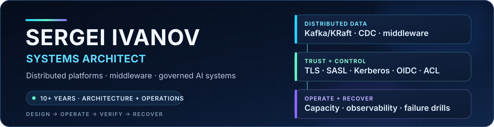

  

  <a href="https://kavioavio.ru">Website</a> ·
  <a href="https://www.linkedin.com/in/sergei-ivanov-73856b3a7">LinkedIn</a>

I am a systems architect. I work on distributed platforms end to end: topology,
identity, deployment, observability, failure handling, and recovery. Ten years of
that has been systems integration and middleware in production — Kafka, MQ, CDC,
and the operational path around them.

For the last stretch my work has been agent runtimes, and the same question keeps
coming up in a new setting: when a long-running process claims it did something,
what can you actually check?

## What I am building now

**An agent runtime with provable execution.** A Go core where a run is a durable
object rather than a session: an append-only event log as the only source of
truth, resumption from recorded state after a crash, permission decisions owned
by the runtime rather than by the model or the client, a fresh human approval for
every external effect, and completion decided by a verifier the runtime executes
itself.

Source-available release is coming; the repository is private while the surface
settles.

## How I work

- **Start from failure domains, authority boundaries, and recovery objectives** —
  not from the happy path.
- **Bind documentation claims to runnable checks.** Where no check exists, say so
  in the document instead of rounding the gap away.
- **Treat configure, apply, read back, and roll back as one change contract.**
- **Verify the real client path** after infrastructure health returns green.
- **Rehearse failure and clean-host recovery** before relying on a design.
- **A green exit code is not a result.** Whatever produced it — a test, a script,
  or a model — the claim needs an oracle that would have failed.

## Focus

| Area | Work |
|---|---|
| Distributed streaming | Kafka/KRaft topology, quorum design, replication, `min.insync.replicas`, capacity, upgrades, failure boundaries |
| Integration and middleware | Event-driven integration, CDC, connectors, APIs, message contracts, IBM MQ, IBM Integration Bus |
| Identity and policy | TLS/mTLS, SASL, Kerberos, OAuth/OIDC, ACL/RBAC, secret boundaries, fail-closed automation |
| Governed AI execution | Durable run state, permission authority, human approval for real effects, evidence and receipts, multi-provider routing |
| Production operations | Observability, capacity planning, runbooks, rolling changes, backup/DR decisions, restore tests, incident recovery |

## Core technologies

`Go` · `Apache Kafka` · `KRaft` · `IBM MQ` · `IBM Integration Bus` · `Python` ·
`Linux` · `PostgreSQL` · `Docker` · `Kubernetes` · `Ansible` · `Prometheus` ·
`Grafana`

## Public repositories

Most of what I work on lives in private repositories. The public entries on this
account are forks I keep as working copies, not projects of mine:

- [`graphify`](https://github.com/kavioavio/graphify) — fork of
  [Graphify-Labs/graphify](https://github.com/Graphify-Labs/graphify).
- [`hermes-agent`](https://github.com/kavioavio/hermes-agent) — fork of
  [NousResearch/hermes-agent](https://github.com/NousResearch/hermes-agent).

## Public GitHub activity

  

Generated from public GitHub events. Private repository activity is excluded, so
this chart understates the work.

## Contact

For systems architecture, middleware, platform engineering, or technical advisory
work: [LinkedIn](https://www.linkedin.com/in/sergei-ivanov-73856b3a7) ·
[kavioavio.ru](https://kavioavio.ru)

<!-- github-profile-readme -->
